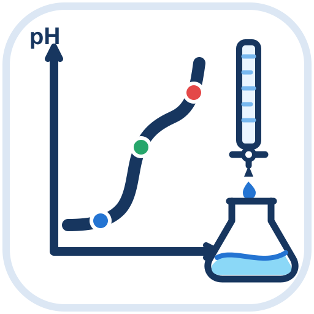

# titration-curve-editor



高校化学の試験問題・授業教材・解説資料向けに、理論滴定曲線を編集可能なSVG/PNG図版として生成するWebアプリです。

## すぐ使う

一般利用者はNode.jsやnpmをインストールする必要はありません。GitHub Pagesの公開URLをブラウザで開くだけで利用できます。

> 公開URLは、repository ownerがGitHub Pagesを有効化した後にここへ記載します。ユーザー名が未確定のため、存在しないURLは掲載していません。

一度onlineで正常に読み込むと、対応ブラウザではアプリ本体がcacheされ、offlineでも滴定計算、図版編集、SVG/PNG出力の基本機能を利用できます。初回読み込みと更新取得にはネットワーク接続が必要です。

### Windows

ChromeやEdge等で公開URLを開いて利用します。対応ブラウザではブラウザの標準メニューやinstall表示からアプリとしてインストールできます。

### Mac

SafariやChrome等で公開URLを開いて利用します。対応するOS・ブラウザではDockへの追加またはアプリとしてのインストールが可能です。

独自のinstall buttonは設けていません。利用中のブラウザが提供する標準機能を使用してください。

## 現在のPhase

現在はv1.0.0 Release Candidateです。化学的に計算した滴定曲線を日本語UIで編集・プレビューし、同じSVG文字列をSVGまたはPNGとして保存できます。GitHub Pages配布とPWA install・offline precacheにも対応しています。

## 技術構成

- TypeScript（strict mode）
- HTML / CSS
- Vite
- Vitest
- vite-plugin-pwa（generateSW）
- SVGをsingle source of truthとする描画・プレビュー・出力

React、Vue、Svelte等のUIフレームワーク、バックエンド、DB、クラウドサービスは使用していません。

## 開発者向けセットアップ

以下は開発・検証を行う場合だけ必要です。一般利用者にはNode.js/npmは不要です。

Node.jsとnpmを用意し、リポジトリ直下で実行します。Node.jsはVite 7の要件に合わせて`^20.19.0 || >=22.12.0`を使用してください。つまり、Node.js 20系では20.19.0以上、またはNode.js 22.12.0以上が必要です。

```sh
npm install
```

## Development server

```sh
npm run dev
```

表示されたローカルURLをブラウザで開きます。

GitHub Pages用のbase pathを設定しているため、開発サーバーが表示する`/titration-curve-editor/`付きURLを使用してください。development modeではService Workerを有効にせず、cacheによる開発時の混乱を避けています。

## Test

```sh
npm test
```

watch mode:

```sh
npm run test:watch
```

型検査のみ:

```sh
npm run typecheck
```

## Build

```sh
npm run build
```

成果物は`dist/`へ生成されます。

production buildとPWAをローカル確認する場合:

```sh
npm run preview
```

表示された`/titration-curve-editor/`付きURLを開きます。Service Worker、offline動作、manifestはproduction build/previewで確認してください。

## GitHub Pagesの公開設定（repository owner向け）

1. GitHub repositoryの **Settings** を開く。
2. **Pages** を開く。
3. **Build and deployment** の **Source** を **GitHub Actions** にする。
4. `main`へpushするか、Actions画面から`Deploy to GitHub Pages`を手動実行する。
5. deployment完了後、表示された公開URLをREADMEの「すぐ使う」へ記載する。

workflowは`npm ci`、typecheck、全test、production buildを順に実行し、`dist/`だけをGitHub Pagesへdeployします。project siteのbase pathは`/titration-curve-editor/`です。

## 設計文書

- [プロジェクト仕様](./docs/project-specification.md)
- [酸塩基平衡・計算仕様](./docs/calculation-spec.md)
- [UI・描画・テスト仕様](./docs/ui-rendering-test-spec.md)
- [アイコンアセット](./docs/icon-assets.md)

## Phase 8までに実装済み

- 多段階のprotonation speciesとdissociation stepを表すDomain Model
- `complete`と`equilibrium`を区別する解離step
- 『化学便覧 基礎編 改訂6版』を基礎とする高校教材用Ka/Kb（25 ℃）と出典・注記を保持する物質マスター
- Ca(OH)2 / Ba(OH)2の式量あたりOH⁻数を保持する構造
- 12物質を登録した初期Substance Master構造
- 複数当量点・複数特徴点を保持する結果モデル
- Graph Style Model
- 滴定入力の基本Validation
- 任意段数のprotonation species distribution
- 物質収支・固定イオンを含む電荷収支
- pH空間相当の`log10([H+])`における決定的bisection solver
- 任意の滴下体積を解く`calculatePHAtVolume`
- 複数の化学量論当量点と半当量点の計算
- HCl、CH3COOH、NH3、H2C2O4、H2SO4、H3PO4、Ca(OH)2を含む回帰fixture
- 酸→塩基・塩基→酸を同一solverで扱う逆滴定テスト
- 最終当量点後の過剰滴下域を含める自動最大滴下体積
- 通常領域のbase samplingと全当量点近傍の局所高密度sampling
- 0 mL、範囲末端、全範囲内当量点・半当量点のexact anchor
- 浮動小数点近接値を含むsampling volumeの重複除去と昇順保証
- `calculateTitrationCurve`による完全な`TitrationResult` / `CurvePoint[]`生成
- `renderTitrationSvg(result, style)`によるpureなSVG文字列生成
- straight-segment curve pathとplot area `clipPath`
- X/Y独立axis、major/minor ticks、nice X ticks、tick formatter
- horizontal/vertical gridの独立表示
- 複数equivalence/characteristic guidesとcircle markers
- white/transparent background、title/axis label、XML escaping
- Default / Exam / Teaching GraphStyle factory・pure preset
- Desktop向けControls / Previewの2カラムBrowser UIと狭幅時の1カラム表示
- Substance Masterから生成するAnalyte / Titrant選択と濃度・体積入力
- canonical formulaはASCIIのまま維持し、UIの物質選択では数字を下付き化した化学式を表示
- raw入力、validated input、計算結果、GraphStyle、SVG文字列を分離したUI state
- 入力validation、計算失敗のユーザー向け表示と、入力途中の直前Preview維持
- 滴定条件変更時だけのcurve再計算と、style変更時のrenderer-only更新
- Exam / Teaching preset controlsと、適用後の個別style編集
- Teaching presetのhorizontal/vertical gridはともにON
- curve、X/Y axes、range、major/minor ticks、grid、guide/marker、figure size、title/label controls
- `renderTitrationSvg()`の出力を直接DOMへ表示するLive SVG Preview
- Previewと同一のSVG文字列を`image/svg+xml;charset=utf-8`のBlobとして保存するSVG Export
- Previewと同一のSVG文字列を一時CanvasでrasterizeするPNG Export
- 1倍・2倍・4倍のPNG解像度（既定2倍）と、SVG設定・白・透明の背景選択
- PNG変換・download双方の一時Object URL解放と、Canvas寸法・100MP安全上限validation
- ユーザー向け表示を日本語へ統一したBrowser UI
- 自由指定、1:1、4:3、3:2、16:9、任意比率に対応する縦横比設定と固定ON/OFF
- 目盛り数値、軸ラベル、タイトルのfont size（pt）とfont-familyを独立調整するTypography controls
- Typographyに応じて文字切れを防ぐSVG plot margin計算
- X/Y独立の目盛り線方向（外向き・内向き・両方向）
- X/Y軸ラベルの自動・指定位置、軸上位置、軸からの距離調整
- Y軸ラベルの横書き／左90°／右90°の絶対向き切替
- X/Y独立の原点`0`ラベル表示切替
- ゴシック体・明朝体・MS ゴシック・MS Pゴシック・MS 明朝・MS P明朝・Century・sans-serif・serif・任意指定に対応するSVG `font-family`設定
- GitHub Pages project site用の`/titration-curve-editor/` base path
- 192 px / 512 px iconを持つWeb App Manifestとstandalone PWA install
- `generateSW`と`autoUpdate`によるproduction assetのoffline precache
- `main`へのpushまたは手動実行で`dist/`を公開するGitHub Pages Actions workflow

Centuryは英数字を優先し、日本語グリフには`"Yu Mincho"`、`"MS Mincho"`、`serif`の順でfallbackするstackを使用します。SVGへフォントファイル自体は埋め込みません。別のPCでSVGを開いた際に指定フォントが存在しない場合は、`font-family`に指定したfallbackまたは閲覧環境の代替フォントで表示されます。

フォントサイズはMicrosoft Word等と同じpt単位で指定でき、0.5 pt刻みの入力に対応します。SVG内部のlayout計算では`1 pt = 4 / 3 CSS px相当`のuser unitへ換算します。Word上でSVG全体を拡大縮小した場合、文字も図とともに拡大縮小されます。

定数値は試験問題・教材との整合を優先します。酢酸`Ka = 2.69e-5`、アンモニア`Kb = 2.3e-5`、シュウ酸`Ka1 = 9.12e-2`、`Ka2 = 1.51e-4`を高校教材用プロファイルとして採用し、NH4+のKaは同じ25 ℃のKwから導出しています。

## 現在未実装の機能

- PDF出力
- user presetや入力条件の永続化

PNGは現在のPCで利用可能なfontを使ってSVGをrasterizeします。font fileは埋め込まず、高倍率ほどファイルサイズと一時的なメモリ消費が増えます。CanvasはPNG生成中だけ使用し、Preview rendererには使用しません。

PWAは外部API、CDN、web fontを追加せず、同じbrowser内計算・SVG renderer・PNG変換を使用します。Service Workerはproduction buildで生成され、development modeでは無効です。自動更新は次回起動時等に新しいprecacheへ切り替わる構成ですが、初回訪問時はonline接続が必要です。

Exam presetはMicrosoft Wordの試験問題へ貼り付けやすい320×240 px（4:3）を標準とし、目盛り数値・軸ラベルを各10.5 pt、タイトルを13.5 ptに設定します。曲線と軸線は2 px、目盛り線は1.5 pxとし、小型PNGの印刷でも軸が弱くならない設定です。PNGは2倍を標準推奨とし、4倍も高解像度用途として利用できます。SVGとPNGには同じGraphStyleが反映され、PNG専用の線幅・font補正は行いません。
